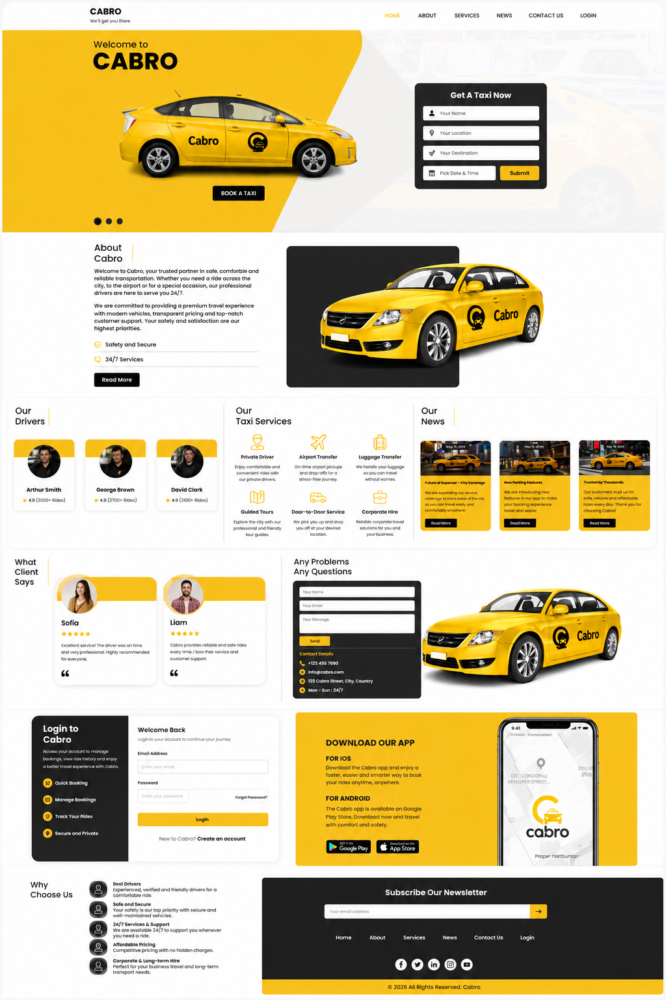

# 🚖 Cabro

### Modern Responsive Taxi Service Website

<p align="center">
  
</p>

<p align="center">
A modern, responsive taxi service landing page built with HTML5, CSS3, JavaScript, Bootstrap 5, jQuery, and Owl Carousel.
</p>

<p align="center">
  <a href="https://absshoyeb.github.io/CABRO/">🌐 Live Demo</a>
  &nbsp;•&nbsp;
  <a href="https://github.com/absshoyeb/CABRO">📂 Source Code</a>
  &nbsp;•&nbsp;
  <a href="https://absshoyeb.com">👨‍💻 Portfolio</a>
</p>

---

# 📖 Overview

Cabro is a modern, fully responsive taxi service landing page designed to showcase a professional transportation business. The project demonstrates clean UI design, responsive layouts, reusable components, and interactive frontend functionality.

Visitors can explore available services, meet professional drivers, browse customer testimonials, read company news, submit booking requests, and access contact information through a polished single-page experience.

This project was built as part of my frontend portfolio to demonstrate practical web development skills using modern frontend technologies.

---

# ✨ Features

- 🚖 Modern single-page layout
- 📱 Fully responsive design
- 🎠 Bootstrap hero image slider
- 👨‍✈️ Driver showcase carousel
- ⭐ Customer testimonials carousel
- 📅 Taxi booking interface
- 📍 About company section
- 🚕 Taxi services section
- 📰 Company news section
- 📞 Contact section
- 🔐 Login interface
- 📲 Mobile app promotion
- 💌 Newsletter subscription
- 🎯 Active navigation highlighting
- ✨ Smooth hover animations
- 🖼️ Optimized WebP images

---

# 🚕 Services

Cabro showcases multiple transportation services, including:

- Private Driver
- Airport Transfer
- Luggage Transfer
- Guided Tours
- Door-to-Door Service
- Corporate Hire

---

# 🛠️ Tech Stack

### Frontend

- HTML5
- CSS3
- JavaScript (ES6)

### Frameworks & Libraries

- Bootstrap 5
- jQuery
- Owl Carousel

### Design

- CSS Variables
- Flexbox
- CSS Grid
- Media Queries
- Google Fonts (Poppins)

---

# ⚙️ JavaScript Functionality

The project includes several interactive frontend features:

- Automatic hero slider
- Driver carousel
- Testimonial carousel
- Active navigation highlighting
- Instant section navigation
- Mobile navigation collapse
- Booking form validation
- Contact form validation
- Login form validation
- Newsletter validation
- Dynamic copyright year

---

# 📱 Responsive Design

The website is optimized for:

- 🖥️ Desktop
- 💻 Laptop
- 📱 Tablet
- 📲 Mobile
- 📳 Small mobile devices

Responsive improvements include:

- Mobile navigation
- Flexible hero section
- Responsive booking form
- Adaptive services grid
- Responsive contact section
- Mobile-friendly login layout
- Responsive typography
- Optimized spacing

---

# 📂 Project Structure

```text
CABRO/
│
├── css/
│   ├── bootstrap.min.css
│   ├── owl.carousel.min.css
│   ├── style.css
│   └── responsive.css
│
├── images/
│   ├── slider/
│   ├── drivers/
│   ├── clients/
│   ├── news/
│   ├── icons/
│   └── ...
│
├── js/
│   ├── jquery-3.7.1.min.js
│   ├── bootstrap.bundle.min.js
│   ├── owl.carousel.min.js
│   └── script.js
│
├── screenshot.png
├── index.html
└── README.md
```

---

# 🚀 Getting Started

### Clone the repository

```bash
git clone https://github.com/absshoyeb/CABRO.git
```

### Navigate to the project

```bash
cd CABRO
```

### Run the project

Open **index.html** in your browser.

For development, using **Visual Studio Code** with the **Live Server** extension is recommended.

---

# 📌 Current Status

Cabro is currently a **frontend portfolio project**.

The booking, contact, login, and newsletter forms include client-side validation for demonstration purposes. They are not connected to a backend server, database, email service, or authentication system.

---

# 🚀 Future Enhancements

- Backend integration
- User authentication
- Database connectivity
- Online booking system
- Google Maps integration
- Live driver tracking
- Payment gateway
- Customer dashboard
- Admin dashboard
- Email notifications
- Booking history
- Dark mode
- SEO improvements
- Accessibility enhancements

---

# 👨‍💻 Author

**Abu Bakar Siddik Shoyeb**

Frontend Developer passionate about building modern, responsive, and user-friendly web experiences.

🌐 **Portfolio**  
https://absshoyeb.com

💼 **LinkedIn**  
https://www.linkedin.com/in/your-username/

💼 **GitHub**  
https://github.com/absshoyeb

📧 **Email**  
info.absshoyeb@gmail.com

---

# ⭐ Support

If you enjoyed this project or found it useful, consider giving the repository a ⭐ on GitHub.

---

# 📄 License

This project was created for educational and portfolio purposes.

© 2026 Abu Bakar Siddik Shoyeb. All Rights Reserved.
